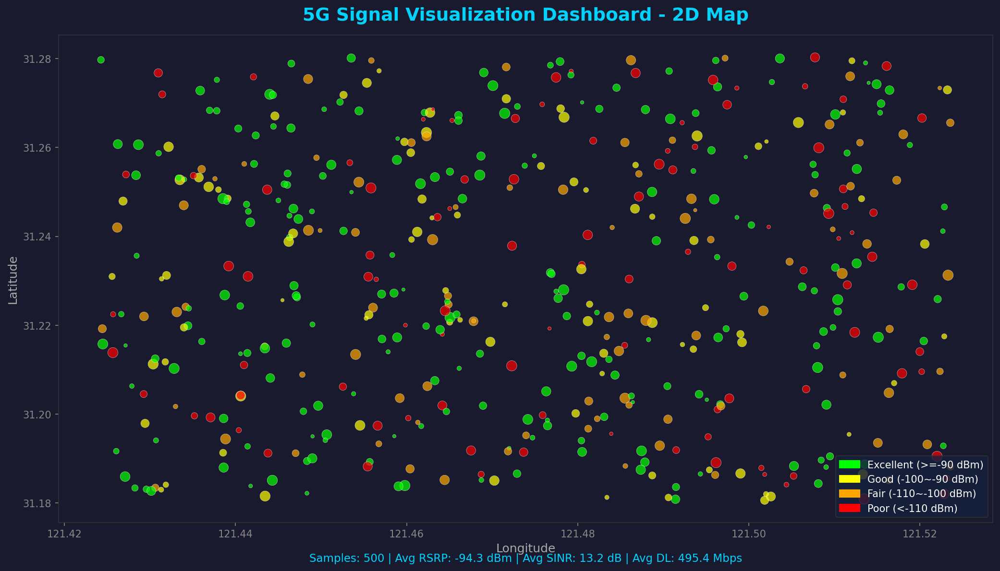
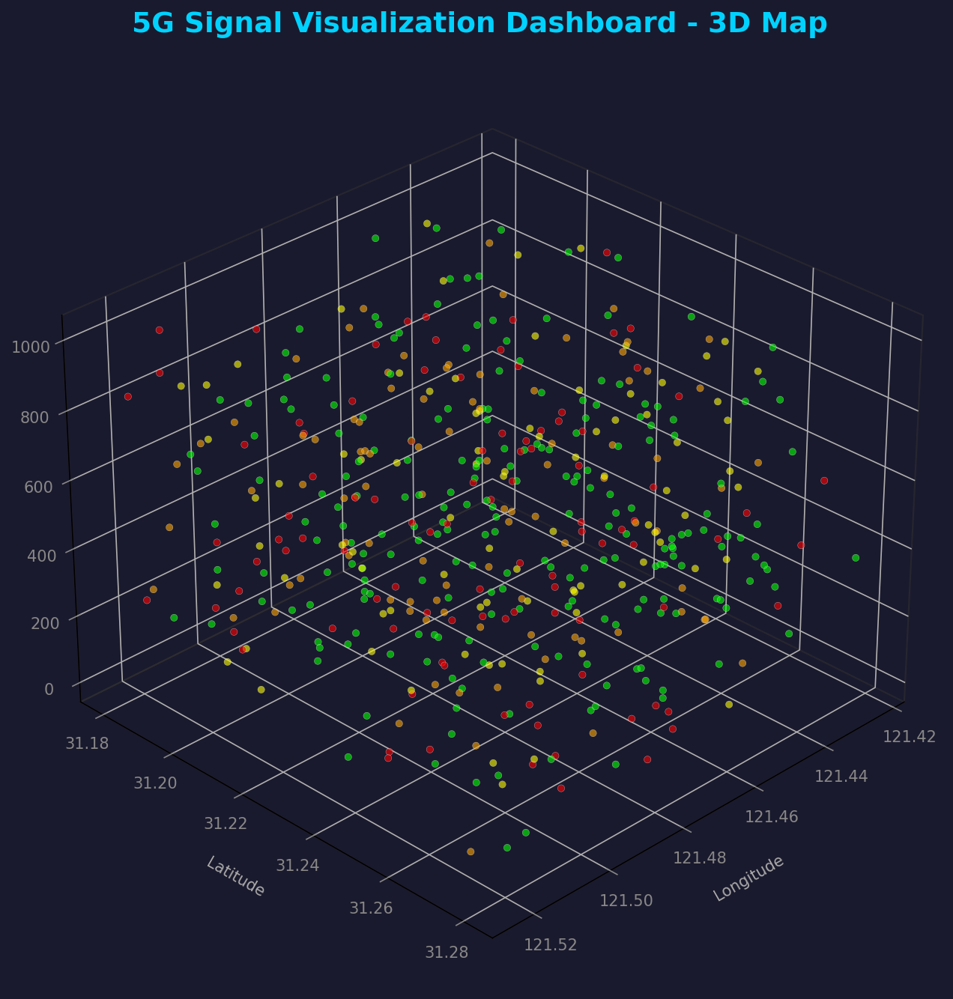
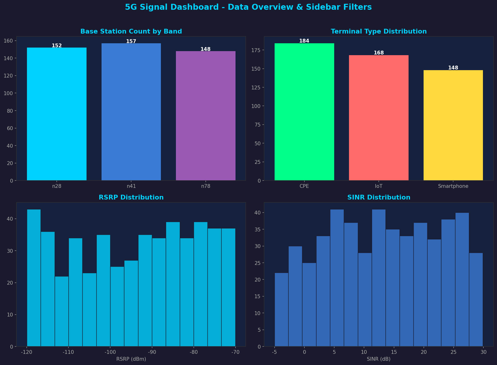

# 📡 5G 信号可视化看板

> "Code with AI" 海选赛参赛作品 — 基于 Streamlit + PyDeck 的 5G 路测数据交互式可视化看板

---

## 📌 项目简介

本项目利用 **Streamlit** 和 **PyDeck** 框架，将 5G 路测信号数据（`signal_samples.csv`）转化为一个功能丰富的交互式 Web 可视化看板。所有代码均由 **AI Coding Agent (SOLO)** 辅助生成，展示了如何通过自然语言指令快速构建数据可视化应用。

---

## ✨ 功能特性

### 🟢 基础关卡（已完成）

| 功能 | 说明 |
|------|------|
| **数据加载** | 使用 pandas 读取 `data/signal_samples.csv`，支持数据缓存加速 |
| **信号散点地图** | 基于 PyDeck 的交互式散点地图，支持缩放、拖拽、悬停查看详情 |
| **RSRP 变色** | 地图上的点根据信号强度自动变色：🟢 优秀(≥-90dBm) / 🟡 良好(-100~-90) / 🟠 一般(-110~-100) / 🔴 较差(<-110) |
| **数据概览图表** | 柱状图展示各频段基站数量和不同终端类型占比 |
| **指标卡片** | 顶部展示信号采样点数、平均 RSRP、平均 SINR、平均下载速率 |

### 🟡 进阶关卡（已完成）

| 功能 | 说明 |
|------|------|
| **侧边栏联动筛选** | 支持按频段（多选）、终端类型（多选）、RSRP 范围（滑动条）、SINR 范围（滑动条）筛选，地图和图表实时更新 |
| **3D 极客地图** | 使用 PyDeck ColumnLayer 渲染 3D 柱状图，柱高随下载速率变化，支持旋转和缩放 |
| **工程化素养** | 核心代码包含完整的 docstring 注释，并提供 21 个单元测试用例 |

---

## 🛠️ 技术栈

- **Python 3.8+**
- **Streamlit** — Web 应用框架
- **Pandas** — 数据处理
- **PyDeck** — 交互式地图渲染（2D 散点图 + 3D 柱状图）
- **NumPy** — 数值计算

---

## 🚀 快速开始

### 1. 克隆仓库

```bash
git clone https://github.com/1360550470/code-with-ai-contest.git
cd code-with-ai-contest
```

### 2. 安装依赖

```bash
pip install -r requirements.txt
```

### 3. 运行应用

```bash
streamlit run app.py
```

浏览器会自动打开 `http://localhost:8501`，即可看到 5G 信号可视化看板。

### 4. 运行单元测试

```bash
python -m unittest test_app -v
```

---

## 📂 项目结构

```
code-with-ai-contest/
├── app.py                  # 主应用程序（Streamlit 看板）
├── test_app.py             # 单元测试（21 个测试用例）
├── requirements.txt        # Python 依赖
├── AI_PROMPTS.md           # AI Agent 交互日志
├── README.md               # 项目说明文档
├── data/
│   └── signal_samples.csv  # 5G 模拟信号数据集
└── screenshots/            # 运行截图
    ├── screenshot_2d_map.png
    ├── screenshot_3d_map.png
    └── screenshot_sidebar.png
```

---

## 📊 数据字段说明

| 字段 | 类型 | 说明 |
|------|------|------|
| Latitude | float | 纬度 |
| Longitude | float | 经度 |
| CellID | int | 小区标识 |
| Band | str | 频段（n28/n78/n41） |
| RSRP_dBm | float | 参考信号接收功率 (dBm) |
| SINR_dB | float | 信号与干扰加噪声比 (dB) |
| TerminalType | str | 终端类型（Smartphone/CPE/IoT） |
| Download_Mbps | float | 下载速率 (Mbps) |

---

## 📸 运行截图

### 2D 信号散点地图


### 3D 极客柱状地图


### 侧边栏筛选交互


---

## 🤖 AI Agent 使用说明

本项目完全由 **SOLO AI Coding Agent** 辅助开发。开发过程中通过自然语言指令完成以下工作：

1. 数据加载与预处理
2. 交互式地图渲染（2D + 3D）
3. 侧边栏联动筛选器实现
4. 数据可视化图表生成
5. 单元测试编写
6. 文档撰写

详细的 AI 交互记录请参见 [AI_PROMPTS.md](AI_PROMPTS.md)。

---

## 📄 许可证

本项目为 "Code with AI" 海选赛参赛作品。
